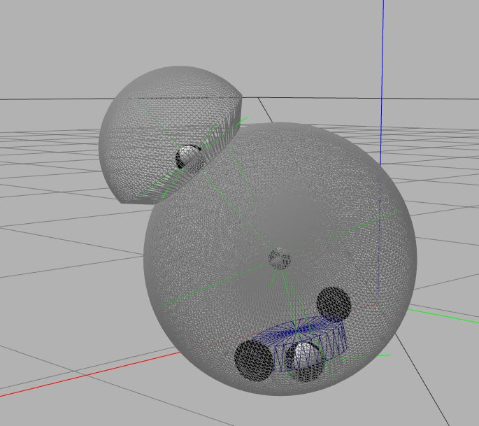
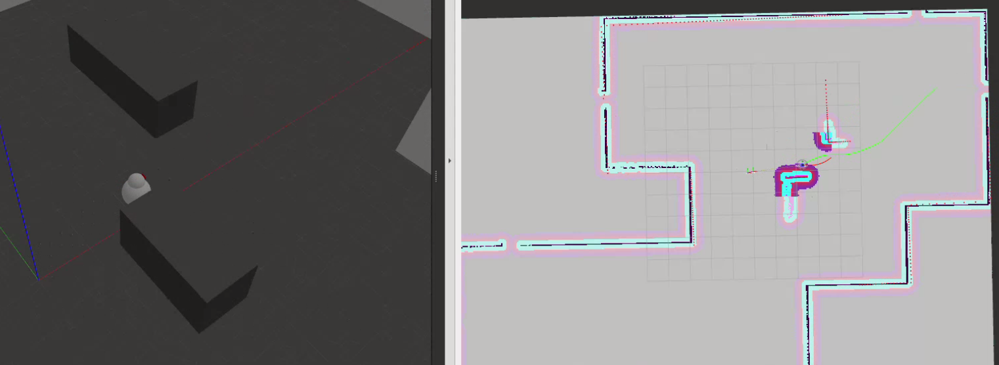
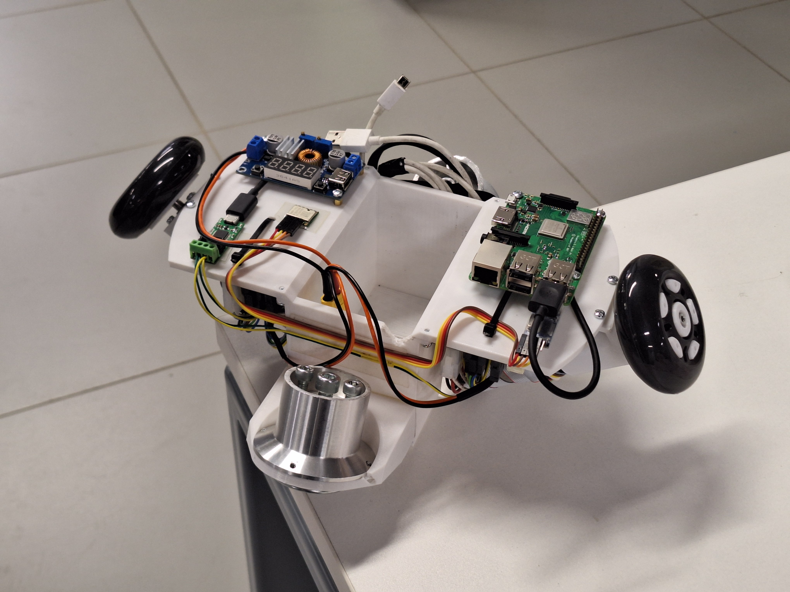

# 🤖 BB-8 Inspired Spherical Companion Robot
---

## 🔍 Overview  
This project implements an autonomous spherical robot inspired by BB-8, combining **hamster drive mechanics** (an internal differential-drive robot propelling an outer sphere) and a **2-DOF revolute "neck"** for LiDAR/camera orientation. Our goal is to design a system integrating computer vision, hardware control, and motion planning to enable autonomous navigation and user interaction.

The repository is split into two branches:  
- **Simulation**: Gazebo environment for testing control algorithms.  
- **Hardware**: Implementation for a physical prototype.



---

## ⚙️ Features  
- **Hamster Drive**: Internal differential-drive system for stable, collision-resilient motion  
- **2-DOF Neck**: Tilt/swivel head mechanism for dynamic sensor orientation 
- **ROS2 NAV2 Stack**: SLAM, path planning, and obstacle avoidance
---

## 🧪 Simulation  
### Dependencies  
- ROS2 packages: `nav2`, `slam_toolbox`, `ros2_control`

### Usage  
1. Build a map:
   ```bash  
   ros2 launch bb8_bringup mapping.launch.py
   ```  
2. Launch navigation to a goal on a pre-built map: 
   ```bash  
   ros2 launch bb8_bringup navigation.launch.py
   ```  
3. Follow a target:  
   ```bash  
    ros2 launch bb8_bringup follower.launch.py
   ```



---

## 🛠️ Hardware  
### Dependencies

Requires ROS2 (tested on ) and python-can package:
```bash
pip install python-can
```
To run keyboard control, install additionally following ROS2 package:
```bash
sudo apt install ros-humble-teleop-twist-keyboard
```

### Usage  

To run keyboard control, switch to the hardware branch:
```bash
git checkout hardware
```

Build:
```bash
colcon build --packages-select maxon_epos4_base
```

Then run following commands, one per command shell:
```bash
ros2 run maxon_epos4_base motor_control
ros2 run teleop_twist_keyboard teleop_twist_keyboard
```



---

## 🚀 Future Plans

--- 
